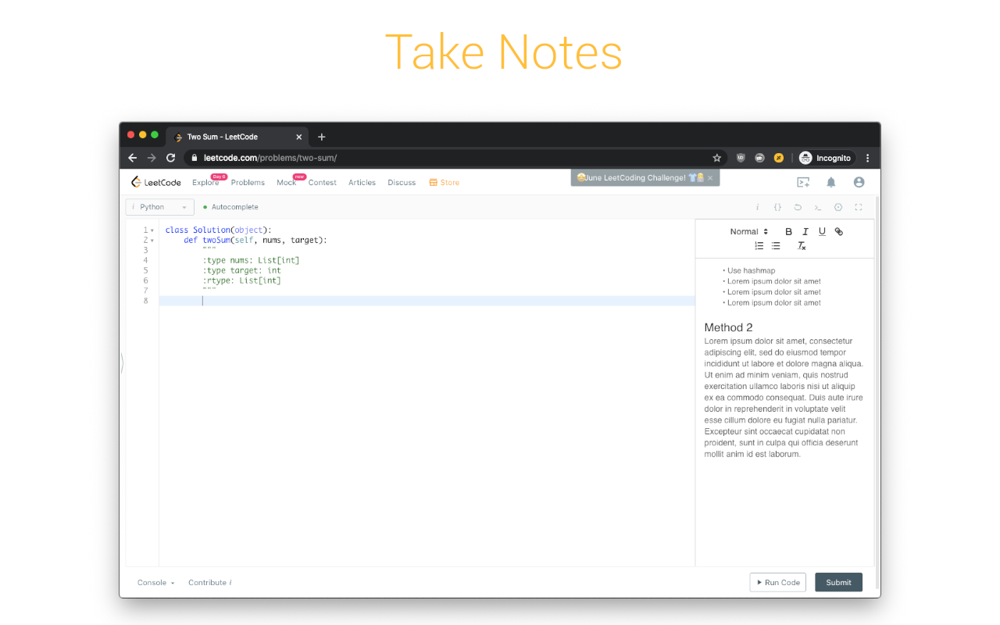
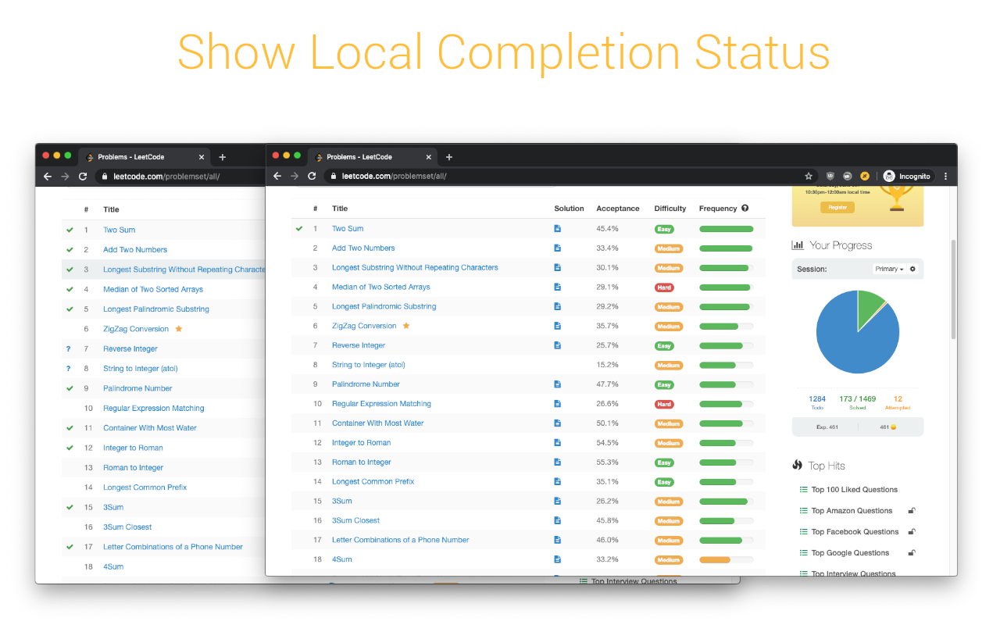
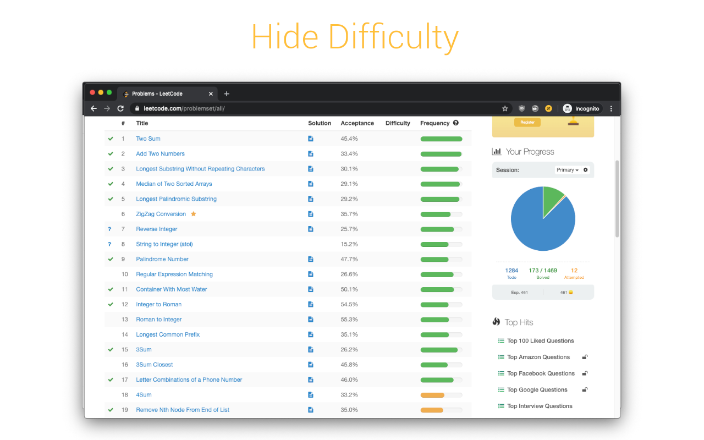
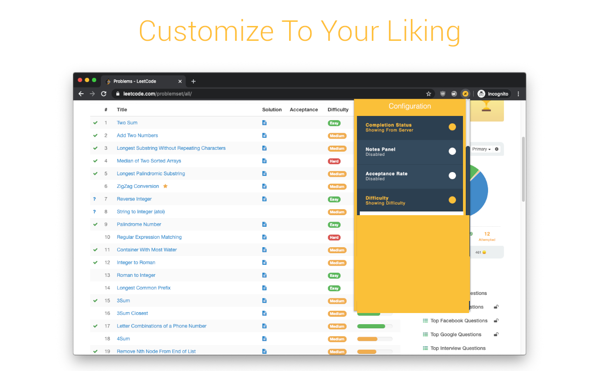
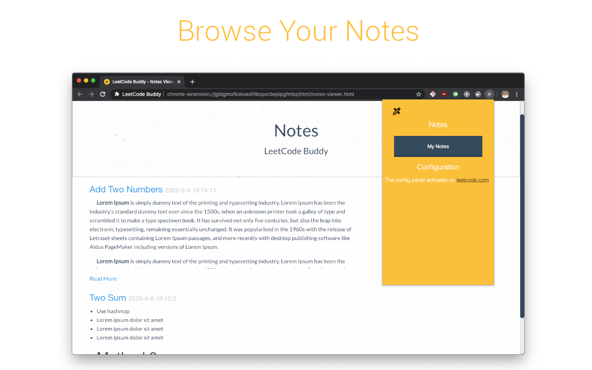

# LeetCode Buddy

## Features
- Write notes while doing problems
- Browse through all your notes on a sepearte page
- Show/Hide
  - Completion Status
  - Acceptance Rate
  - Difficulty
  - Locked Questions
  - Announcements 
  - Problem Search Result Count 
  - Solved Problem Difficulty Counts
 
## Screenshots

## License 

## Credits
Icons made by [Freepik](https://www.flaticon.com/authors/freepik "Freepik") from [www.flaticon.com](https://www.flaticon.com/ "Flaticon")

## Contact
If you'd like to provide any feedback, my e-mail is on my GitHub profile. You can also use the contact form on [my website](https://tash-had.com/#contact). 
